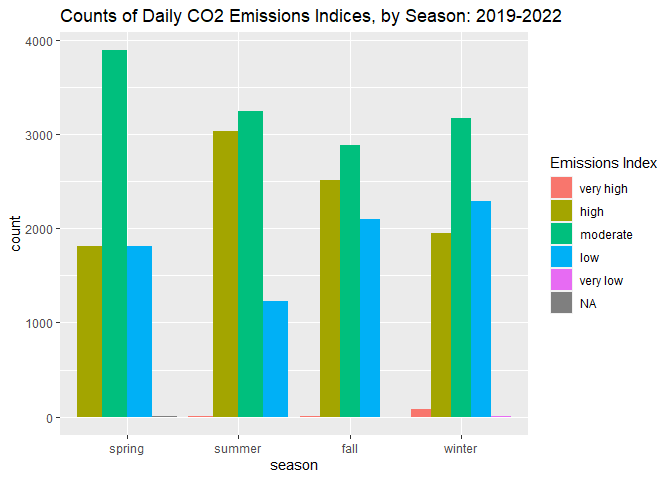
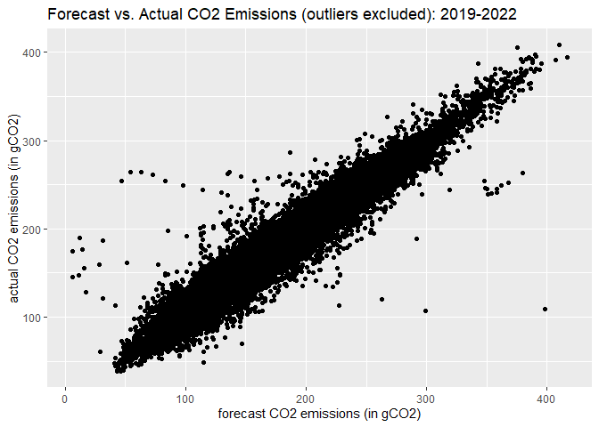
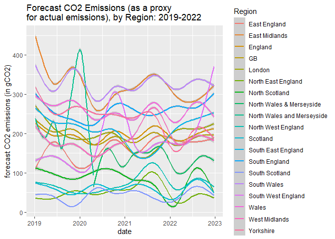

ST558 Fall 2023, Project 2
================
Terry McTest
2023-10-11

<br>

This vignette focuses on a custom function that was developed for use in
conjunction with a particular API (Application Programming Interface) in
order to query, parse, and return well-structured data. After using said
function to obtain data, this vignette presents results from an
exploratory data analysis. <br>

# The Official Carbon Intensity API for Great Britain

The Carbon Intensity API provides information regarding regional carbon
intensity of the electricity system in Great Britain. Since carbon
intensity varies by hour, day, and season (due changes in demand as well
as variation in the means of generating electricity), these data are
stored at the micro-level, e.g. individual carbon intensity readings for
each half-hour period over a number of years. Per the \[National Grid’s
Carbon Intensity API website\]
(<https://carbon-intensity.github.io/api-definitions/?shell#carbon-intensity-api-v2-0-0>):

> National Grid’s Carbon Intensity API provides an indicative trend of
> regional carbon intensity of the electricity system in Great Britain
> (GB) up to 2 days ahead of real-time. It provides programmatic and
> timely access to both forecast and estimated carbon intensity data.
> The Carbon Intensity forecast includes CO2 emissions related to
> electricity generation only. The includes emissions from all large
> metered power stations, interconnector imports, transmission and
> distribution losses, and accounts for national electricity demand,
> embedded wind and solar generation.

The API consists of three primary endpoints:

- *National-level carbon intensity*. This endpoint includes a continuous
  measure of forecasted CO2 emissions per kilowatt hour of electricity
  produced; a continuous measure of actual CO2 emissions produced; and a
  categorical measure of actual CO2 emissions produced.
- *National-level electricity-generation mix*. This endpoint includes
  the percent distribution of how electricity is generated across
  various generation sources, including biomass, coal, imports, gas,
  nuclear, hydro, solar, wind, and “other”.
- *Regional-level carbon intensity & electricity-generation mix*. This
  endpoint includes (most) measures made available in the above
  endpoints, though measures in the regional-level endpoint are stored
  at a regional level (i.e. for each of 18 regions of Great Britain) as
  opposed to being stored at a national level. <br>

# Function for Returning Data From the API

Before proceeding, we should make note of the specific R packages that
are employed by either the custom function presented here, and/or by the
exploratory data analysis to follow:

``` r
library(httr)
library(dplyr)
library(tidyr)
library(jsonlite)
library(tidyverse)
library(ggradar)
library(scales)
```

<br>

A function intended to return data from the Carbon Intensity (CI) API
must be capable of navigating certain features of this API:

- The CI API needs to know the window of time for which data is desired,
  even if that “window” is essentially a specific point in time
  (e.g. “right now”) as opposed to an actual extended window.
- The CI API is comprised of data objects nested within data objects
  (e.g. data frames within data frames), and these structures must be
  un-nested and re-structured to facilitate use of the data.
- In general terms, the national data is structured as one record per
  each half-hour period contained within the specified window of time,
  while the regional data is structured with 18 records (one for each
  region) per each half-hour period contained within the specified
  window of time. The function must account for whether one or both
  types of data are desired (i.e. national-level data and/or
  regional-level data).

The function presented here addresses the above features of the CI API
by first requesting specification of the following arguments:

- `from_dt` and `to_dt`: These are required arguments, each representing
  a timestamp which bookends the window of time for which data is
  desired.
- `want_int`, `want_gen`, `want_reg_wide`, and `want_reg_long`: These
  are optional arguments through which the end user specifies (by
  setting the applicable argument equal to 1) whether they are
  requesting national-level intensity data; national-level
  generation-mix data; regional-level data (in wide format); and/or
  regional-level data (in long format).

The output of the CI API function call (named simply `carbon` as shown
here) is a list comprised of either: one wide dataset + one long
dataset; a wide dataset only; or a long dataset only. More specifically,
by selectively setting the aforementioned optional arguments to 1, the
user will receive a wide dataset comprised of either:

1.  national-level intensity data + national-level generation-mix data +
    regional-level data;
2.  national-level intensity data + national-level generation-mix data;
3.  national-level intensity data + regional-level data;
4.  national-level generation-mix data + regional-level data;
5.  national-level intensity data only;
6.  national-level generation-mix data only; or
7.  regional-level data only

Each version of the wide dataset listed above can be output with or
without an accompanying long dataset of regional-level data, for a total
of (7 x 2) + 1 = 15 data request options/combinations (the “+1” option
would be the long dataset of regional-level data with no wide dataset).
Notably, each of these 15 options/combinations could be used in
conjunction with an infinite number of time windows, providing the user
with an even greater number of options for each data request.

As seen below, the `carbon` function also performs some niceties such as
imposing order on categorical variables, and converting the bookend
timestamps (which are actually character textstrings in
“YYYY-MM-DDTHH:MMZ” format as required to access the CI API) to various
date values to facilitate the forthcoming exploratory data analysis.

The code chunk to follow shows R syntax for the entire `carbon`
function, annotated with comments to describe the purpose of each
sub-chunk of code:

``` r
carbon <- function(from_dt, to_dt, want_int=0, want_gen=0, want_reg_wide=0, want_reg_long=0)

{
  
#national-level carbon intensity data/endpoint

if(want_int==1)
{
base = "https://api.carbonintensity.org.uk/intensity/"
slash = "/"
int_url = paste0(base, from_dt, slash, to_dt)

int_api <- GET(int_url)
parsed_int <- fromJSON(rawToChar(int_api$content))
#str(parsed_int$data)
#as_tibble(parsed_int$data)

int <-
  parsed_int$data %>%
  as_tibble() %>%
  unnest(intensity)
}

  

#national-level electricity-generation mix data/endpoint

if(want_gen==1)
{
base = "https://api.carbonintensity.org.uk/generation/"
slash = "/"
gen_url = paste0(base, from_dt, slash, to_dt)
  
gen_api <- GET(gen_url)
parsed_gen <- fromJSON(rawToChar(gen_api$content))
#str(parsed_gen$data)
#as_tibble(parsed_gen$data)

gen <-
  parsed_gen$data %>%
  as_tibble() %>%
  unnest(generationmix) %>%
  pivot_wider(names_from = fuel, values_from = perc)
}


  
#regional-level data/endpoint
  
if(want_reg_wide==1 | want_reg_long==1)
{
base = "https://api.carbonintensity.org.uk/regional/intensity/"
slash = "/"
reg_url = paste0(base, from_dt, slash, to_dt)
  
regional_api <- GET(reg_url)
parsed_regional <- fromJSON(rawToChar(regional_api$content))
#str(parsed_regional$data)
#as_tibble(parsed_regional$data)
  
reg_long <-
  parsed_regional$data %>%
  as_tibble() %>%
  unnest(regions) %>%
  unnest(intensity) %>%
  unnest(generationmix) %>%
  pivot_wider(names_from = fuel, values_from = perc)
}
  
if(want_reg_wide==1)
{
reg_wide <-
 reg_long %>%
  select(from, to, regionid, forecast, index, biomass, coal, imports, gas, nuclear, other, hydro, solar, wind) %>%
  pivot_wider(names_from = regionid, 
    values_from = c(forecast, index, biomass, coal, imports, gas, nuclear, other, hydro, solar, wind))
}
  
  

#compile the *wide* dataset for outputting
  
if(want_int==1 & want_gen==1 & want_reg_wide==1)
  {carbon_wide <- full_join(int, gen, by=c("to"="to", "from"="from"))
   carbon_wide <- full_join(carbon_wide, reg_wide, by=c("to"="to", "from"="from"))}
  
else if(want_int==1 & want_gen==1)
  {carbon_wide <- full_join(int, gen, by=c("to"="to", "from"="from"))}

else if(want_int==1 & want_reg_wide==1)
  {carbon_wide <- full_join(int, reg_wide, by=c("to"="to", "from"="from"))}
  
else if(want_gen==1 & want_reg_wide==1)
  {carbon_wide <- full_join(gen, reg_wide, by=c("to"="to", "from"="from"))}

else if(want_int==1)
  {carbon_wide <- int}
  
else if(want_gen==1)
  {carbon_wide <- gen}

else if(want_reg_wide==1)
  {carbon_wide <- reg_wide}


  

#to facilitate downstream analyses, derive a set of more-usable date/season vars

if(want_int==1 | want_gen==1 | want_reg_wide==1)
{
carbon_wide$yyyy = substring(carbon_wide$from, first=1, last=4)
carbon_wide$mm = substring(carbon_wide$from, first=6, last=7)
carbon_wide$yyyymm = paste0(carbon_wide$yyyy, carbon_wide$mm)
carbon_wide$date = as.Date(substring(carbon_wide$from, first=1, last=10), format="%Y-%m-%d")

carbon_wide$season =
  if_else(carbon_wide$mm %in% c("04", "05", "06"), "spring",
  if_else(carbon_wide$mm %in% c("07", "08", "09"), "summer",
  if_else(carbon_wide$mm %in% c("10", "11", "12"), "fall",
  if_else(carbon_wide$mm %in% c("01", "02", "03"), "winter", NA))))
}

if(want_reg_long==1)
{
reg_long$yyyy = substring(reg_long$from, first=1, last=4)
reg_long$mm = substring(reg_long$from, first=6, last=7)
reg_long$yyyymm = paste0(reg_long$yyyy, reg_long$mm)
reg_long$date = as.Date(substring(reg_long$from, first=1, last=10), format="%Y-%m-%d")

reg_long$season =
  if_else(reg_long$mm %in% c("04", "05", "06"), "spring",
  if_else(reg_long$mm %in% c("07", "08", "09"), "summer",
  if_else(reg_long$mm %in% c("10", "11", "12"), "fall",
  if_else(reg_long$mm %in% c("01", "02", "03"), "winter", NA))))
}
  
  
  
#impose ordering on categorical variables
  
if(want_int==1 | want_gen==1 | want_reg_wide==1)
{
carbon_wide$index <- ordered(carbon_wide$index, levels = c("very high", "high", "moderate", "low", "very low"))
carbon_wide$season <- ordered(carbon_wide$season, levels = c("spring", "summer", "fall", "winter"))
}
  
if(want_reg_long==1)
{
reg_long$index <- ordered(reg_long$index, levels = c("very high", "high", "moderate", "low", "very low"))
reg_long$season <- ordered(reg_long$season, levels = c("spring", "summer", "fall", "winter"))
}  
  

  
    
#final output, which is either:
#(1) a list comprised of one long dataset + one wide dataset, (2) a single wide dataset, or (3) a single long dataset
# (the long dataset will always be regional data)
  
if(want_reg_long==1 & (want_int==1 | want_gen==1 | want_reg_wide==1))
  {carbon_dat <- list(reg_long=reg_long, carbon_wide=carbon_wide)}
  
else if(want_int==1 | want_gen==1 | want_reg_wide==1)
  {carbon_dat <- carbon_wide}

else if(want_reg_long==1)
  {carbon_dat <- reg_long}
  
}
```

<br>

# Using the Custom Function to Return Data

Given that the focus of the exploratory data analysis to follow is an
examination of carbon-centric measures over time, we hope to lean on the
function presented above to create a sort of time-series dataset; that
is, a collection of measures observed sequentially in time.
Unfortunately, calls to the CI API are limited to a maximum date range
of 14 days. As a work-around for this limitation, we will call on the
`carbon` function multiple times and stack the resulting datasets
together, in so doing forming a time-series dataset that extends beyond
the 14 day limit. More specifically, we will call the `carbon` function
one time for each year \* month combination from January 2019 and
December 2022 (CI API data is incomplete prior to this window of time).
In each of these `carbon` calls, we will essentially request a sample of
that month’s data, i.e. we will request data for the 2nd and 3rd week
(from the 8th through the 21st) of each year \* month combination. After
doing so, we will have a dataset comprised of one record per each
half-hour interval over a course of 4 years.

``` r
jan2019 <- carbon(from_dt="2019-01-08T12:00Z", to_dt="2019-01-21T12:00Z", want_int=1, want_gen=1, want_reg_wide=1)
feb2019 <- carbon(from_dt="2019-02-08T12:00Z", to_dt="2019-02-21T12:00Z", want_int=1, want_gen=1, want_reg_wide=1)
mar2019 <- carbon(from_dt="2019-03-08T12:00Z", to_dt="2019-03-21T12:00Z", want_int=1, want_gen=1, want_reg_wide=1)
apr2019 <- carbon(from_dt="2019-04-08T12:00Z", to_dt="2019-04-21T12:00Z", want_int=1, want_gen=1, want_reg_wide=1)
may2019 <- carbon(from_dt="2019-05-08T12:00Z", to_dt="2019-05-21T12:00Z", want_int=1, want_gen=1, want_reg_wide=1)
jun2019 <- carbon(from_dt="2019-06-08T12:00Z", to_dt="2019-06-21T12:00Z", want_int=1, want_gen=1, want_reg_wide=1)
jul2019 <- carbon(from_dt="2019-07-08T12:00Z", to_dt="2019-07-21T12:00Z", want_int=1, want_gen=1, want_reg_wide=1)
aug2019 <- carbon(from_dt="2019-08-08T12:00Z", to_dt="2019-08-21T12:00Z", want_int=1, want_gen=1, want_reg_wide=1)
sep2019 <- carbon(from_dt="2019-09-08T12:00Z", to_dt="2019-09-21T12:00Z", want_int=1, want_gen=1, want_reg_wide=1)
oct2019 <- carbon(from_dt="2019-10-08T12:00Z", to_dt="2019-10-21T12:00Z", want_int=1, want_gen=1, want_reg_wide=1)
nov2019 <- carbon(from_dt="2019-11-08T12:00Z", to_dt="2019-11-21T12:00Z", want_int=1, want_gen=1, want_reg_wide=1)
dec2019 <- carbon(from_dt="2019-12-08T12:00Z", to_dt="2019-12-21T12:00Z", want_int=1, want_gen=1, want_reg_wide=1)

jan2020 <- carbon(from_dt="2020-01-08T12:00Z", to_dt="2020-01-21T12:00Z", want_int=1, want_gen=1, want_reg_wide=1)
feb2020 <- carbon(from_dt="2020-02-08T12:00Z", to_dt="2020-02-21T12:00Z", want_int=1, want_gen=1, want_reg_wide=1)
mar2020 <- carbon(from_dt="2020-03-08T12:00Z", to_dt="2020-03-21T12:00Z", want_int=1, want_gen=1, want_reg_wide=1)
apr2020 <- carbon(from_dt="2020-04-08T12:00Z", to_dt="2020-04-21T12:00Z", want_int=1, want_gen=1, want_reg_wide=1)
may2020 <- carbon(from_dt="2020-05-08T12:00Z", to_dt="2020-05-21T12:00Z", want_int=1, want_gen=1, want_reg_wide=1)
jun2020 <- carbon(from_dt="2020-06-08T12:00Z", to_dt="2020-06-21T12:00Z", want_int=1, want_gen=1, want_reg_wide=1)
jul2020 <- carbon(from_dt="2020-07-08T12:00Z", to_dt="2020-07-21T12:00Z", want_int=1, want_gen=1, want_reg_wide=1)
aug2020 <- carbon(from_dt="2020-08-08T12:00Z", to_dt="2020-08-21T12:00Z", want_int=1, want_gen=1, want_reg_wide=1)
sep2020 <- carbon(from_dt="2020-09-08T12:00Z", to_dt="2020-09-21T12:00Z", want_int=1, want_gen=1, want_reg_wide=1)
oct2020 <- carbon(from_dt="2020-10-08T12:00Z", to_dt="2020-10-21T12:00Z", want_int=1, want_gen=1, want_reg_wide=1)
nov2020 <- carbon(from_dt="2020-11-08T12:00Z", to_dt="2020-11-21T12:00Z", want_int=1, want_gen=1, want_reg_wide=1)
dec2020 <- carbon(from_dt="2020-12-08T12:00Z", to_dt="2020-12-21T12:00Z", want_int=1, want_gen=1, want_reg_wide=1)

jan2021 <- carbon(from_dt="2021-01-08T12:00Z", to_dt="2021-01-21T12:00Z", want_int=1, want_gen=1, want_reg_wide=1)
feb2021 <- carbon(from_dt="2021-02-08T12:00Z", to_dt="2021-02-21T12:00Z", want_int=1, want_gen=1, want_reg_wide=1)
mar2021 <- carbon(from_dt="2021-03-08T12:00Z", to_dt="2021-03-21T12:00Z", want_int=1, want_gen=1, want_reg_wide=1)
apr2021 <- carbon(from_dt="2021-04-08T12:00Z", to_dt="2021-04-21T12:00Z", want_int=1, want_gen=1, want_reg_wide=1)
may2021 <- carbon(from_dt="2021-05-08T12:00Z", to_dt="2021-05-21T12:00Z", want_int=1, want_gen=1, want_reg_wide=1)
jun2021 <- carbon(from_dt="2021-06-08T12:00Z", to_dt="2021-06-21T12:00Z", want_int=1, want_gen=1, want_reg_wide=1)
jul2021 <- carbon(from_dt="2021-07-08T12:00Z", to_dt="2021-07-21T12:00Z", want_int=1, want_gen=1, want_reg_wide=1)
aug2021 <- carbon(from_dt="2021-08-08T12:00Z", to_dt="2021-08-21T12:00Z", want_int=1, want_gen=1, want_reg_wide=1)
sep2021 <- carbon(from_dt="2021-09-08T12:00Z", to_dt="2021-09-21T12:00Z", want_int=1, want_gen=1, want_reg_wide=1)
oct2021 <- carbon(from_dt="2021-10-08T12:00Z", to_dt="2021-10-21T12:00Z", want_int=1, want_gen=1, want_reg_wide=1)
nov2021 <- carbon(from_dt="2021-11-08T12:00Z", to_dt="2021-11-21T12:00Z", want_int=1, want_gen=1, want_reg_wide=1)
dec2021 <- carbon(from_dt="2021-12-08T12:00Z", to_dt="2021-12-21T12:00Z", want_int=1, want_gen=1, want_reg_wide=1)

jan2022 <- carbon(from_dt="2022-01-08T12:00Z", to_dt="2022-01-21T12:00Z", want_int=1, want_gen=1, want_reg_wide=1)
feb2022 <- carbon(from_dt="2022-02-08T12:00Z", to_dt="2022-02-21T12:00Z", want_int=1, want_gen=1, want_reg_wide=1)
mar2022 <- carbon(from_dt="2022-03-08T12:00Z", to_dt="2022-03-21T12:00Z", want_int=1, want_gen=1, want_reg_wide=1)
apr2022 <- carbon(from_dt="2022-04-08T12:00Z", to_dt="2022-04-21T12:00Z", want_int=1, want_gen=1, want_reg_wide=1)
may2022 <- carbon(from_dt="2022-05-08T12:00Z", to_dt="2022-05-21T12:00Z", want_int=1, want_gen=1, want_reg_wide=1)
jun2022 <- carbon(from_dt="2022-06-08T12:00Z", to_dt="2022-06-21T12:00Z", want_int=1, want_gen=1, want_reg_wide=1)
jul2022 <- carbon(from_dt="2022-07-08T12:00Z", to_dt="2022-07-21T12:00Z", want_int=1, want_gen=1, want_reg_wide=1)
aug2022 <- carbon(from_dt="2022-08-08T12:00Z", to_dt="2022-08-21T12:00Z", want_int=1, want_gen=1, want_reg_wide=1)
sep2022 <- carbon(from_dt="2022-09-08T12:00Z", to_dt="2022-09-21T12:00Z", want_int=1, want_gen=1, want_reg_wide=1)
oct2022 <- carbon(from_dt="2022-10-08T12:00Z", to_dt="2022-10-21T12:00Z", want_int=1, want_gen=1, want_reg_wide=1)
nov2022 <- carbon(from_dt="2022-11-08T12:00Z", to_dt="2022-11-21T12:00Z", want_int=1, want_gen=1, want_reg_wide=1)
dec2022 <- carbon(from_dt="2022-12-08T12:00Z", to_dt="2022-12-21T12:00Z", want_int=1, want_gen=1, want_reg_wide=1)


wide <-
  bind_rows(
  jan2019, feb2019, mar2019, apr2019, may2019, jun2019, jul2019, aug2019, sep2019, oct2019, nov2019, dec2019,
  jan2020, feb2020, mar2020, apr2020, may2020, jun2020, jul2020, aug2020, sep2020, oct2020, nov2020, dec2020,
  jan2021, feb2021, mar2021, apr2021, may2021, jun2021, jul2021, aug2021, sep2021, oct2021, nov2021, dec2021,
  jan2022, feb2022, mar2022, apr2022, may2022, jun2022, jul2022, aug2022, sep2022, oct2022, nov2022, dec2022)
as_tibble(wide)
```

    ## # A tibble: 30,001 × 217
    ##    from    to    forecast actual index biomass  coal imports   gas nuclear other
    ##    <chr>   <chr>    <int>  <int> <ord>   <dbl> <dbl>   <dbl> <dbl>   <dbl> <dbl>
    ##  1 2019-0… 2019…      221    220 mode…     3     3.3     5    41.8    16.1   0.1
    ##  2 2019-0… 2019…      224    216 mode…     2.5   2.7     5.3  41.9    16.3   0.1
    ##  3 2019-0… 2019…      219    220 mode…     2.4   2.7     5.4  42.4    16.4   0.1
    ##  4 2019-0… 2019…      217    221 mode…     2.4   2.8     5.2  42.6    16.5   0.1
    ##  5 2019-0… 2019…      222    224 mode…     2.5   2.7     5.3  43      16.7   0.1
    ##  6 2019-0… 2019…      224    232 mode…     2.5   3       6.3  44.1    16.8   0.1
    ##  7 2019-0… 2019…      227    246 mode…     2.3   3       6.1  46.5    16.8   0.1
    ##  8 2019-0… 2019…      237    260 high      2.9   3.4     3.7  50      16.8   0.1
    ##  9 2019-0… 2019…      253    270 high      3.6   4.8     4.6  48.3    16.1   0.1
    ## 10 2019-0… 2019…      265    271 high      3.3   5       6.1  48.9    15.4   0.1
    ## # ℹ 29,991 more rows
    ## # ℹ 206 more variables: hydro <dbl>, solar <dbl>, wind <dbl>, forecast_1 <int>,
    ## #   forecast_2 <int>, forecast_3 <int>, forecast_4 <int>, forecast_5 <int>,
    ## #   forecast_6 <int>, forecast_7 <int>, forecast_8 <int>, forecast_9 <int>,
    ## #   forecast_10 <int>, forecast_11 <int>, forecast_12 <int>, forecast_13 <int>,
    ## #   forecast_14 <int>, forecast_15 <int>, forecast_16 <int>, forecast_17 <int>,
    ## #   forecast_18 <int>, index_1 <chr>, index_2 <chr>, index_3 <chr>, …

<br>

Next, we repeat this same process, only this time requesting a long
dataset (comprised of regional-level data) for the exact same 4-year
window of time, i.e. from January 2019 through December 2022.

``` r
jan2019 <- carbon(from_dt="2019-01-08T12:00Z", to_dt="2019-01-21T12:00Z", want_reg_long=1)
feb2019 <- carbon(from_dt="2019-02-08T12:00Z", to_dt="2019-02-21T12:00Z", want_reg_long=1)
mar2019 <- carbon(from_dt="2019-03-08T12:00Z", to_dt="2019-03-21T12:00Z", want_reg_long=1)
apr2019 <- carbon(from_dt="2019-04-08T12:00Z", to_dt="2019-04-21T12:00Z", want_reg_long=1)
may2019 <- carbon(from_dt="2019-05-08T12:00Z", to_dt="2019-05-21T12:00Z", want_reg_long=1)
jun2019 <- carbon(from_dt="2019-06-08T12:00Z", to_dt="2019-06-21T12:00Z", want_reg_long=1)
jul2019 <- carbon(from_dt="2019-07-08T12:00Z", to_dt="2019-07-21T12:00Z", want_reg_long=1)
aug2019 <- carbon(from_dt="2019-08-08T12:00Z", to_dt="2019-08-21T12:00Z", want_reg_long=1)
sep2019 <- carbon(from_dt="2019-09-08T12:00Z", to_dt="2019-09-21T12:00Z", want_reg_long=1)
oct2019 <- carbon(from_dt="2019-10-08T12:00Z", to_dt="2019-10-21T12:00Z", want_reg_long=1)
nov2019 <- carbon(from_dt="2019-11-08T12:00Z", to_dt="2019-11-21T12:00Z", want_reg_long=1)
dec2019 <- carbon(from_dt="2019-12-08T12:00Z", to_dt="2019-12-21T12:00Z", want_reg_long=1)

jan2020 <- carbon(from_dt="2020-01-08T12:00Z", to_dt="2020-01-21T12:00Z", want_reg_long=1)
feb2020 <- carbon(from_dt="2020-02-08T12:00Z", to_dt="2020-02-21T12:00Z", want_reg_long=1)
mar2020 <- carbon(from_dt="2020-03-08T12:00Z", to_dt="2020-03-21T12:00Z", want_reg_long=1)
apr2020 <- carbon(from_dt="2020-04-08T12:00Z", to_dt="2020-04-21T12:00Z", want_reg_long=1)
may2020 <- carbon(from_dt="2020-05-08T12:00Z", to_dt="2020-05-21T12:00Z", want_reg_long=1)
jun2020 <- carbon(from_dt="2020-06-08T12:00Z", to_dt="2020-06-21T12:00Z", want_reg_long=1)
jul2020 <- carbon(from_dt="2020-07-08T12:00Z", to_dt="2020-07-21T12:00Z", want_reg_long=1)
aug2020 <- carbon(from_dt="2020-08-08T12:00Z", to_dt="2020-08-21T12:00Z", want_reg_long=1)
sep2020 <- carbon(from_dt="2020-09-08T12:00Z", to_dt="2020-09-21T12:00Z", want_reg_long=1)
oct2020 <- carbon(from_dt="2020-10-08T12:00Z", to_dt="2020-10-21T12:00Z", want_reg_long=1)
nov2020 <- carbon(from_dt="2020-11-08T12:00Z", to_dt="2020-11-21T12:00Z", want_reg_long=1)
dec2020 <- carbon(from_dt="2020-12-08T12:00Z", to_dt="2020-12-21T12:00Z", want_reg_long=1)

jan2021 <- carbon(from_dt="2021-01-08T12:00Z", to_dt="2021-01-21T12:00Z", want_reg_long=1)
feb2021 <- carbon(from_dt="2021-02-08T12:00Z", to_dt="2021-02-21T12:00Z", want_reg_long=1)
mar2021 <- carbon(from_dt="2021-03-08T12:00Z", to_dt="2021-03-21T12:00Z", want_reg_long=1)
apr2021 <- carbon(from_dt="2021-04-08T12:00Z", to_dt="2021-04-21T12:00Z", want_reg_long=1)
may2021 <- carbon(from_dt="2021-05-08T12:00Z", to_dt="2021-05-21T12:00Z", want_reg_long=1)
jun2021 <- carbon(from_dt="2021-06-08T12:00Z", to_dt="2021-06-21T12:00Z", want_reg_long=1)
jul2021 <- carbon(from_dt="2021-07-08T12:00Z", to_dt="2021-07-21T12:00Z", want_reg_long=1)
aug2021 <- carbon(from_dt="2021-08-08T12:00Z", to_dt="2021-08-21T12:00Z", want_reg_long=1)
sep2021 <- carbon(from_dt="2021-09-08T12:00Z", to_dt="2021-09-21T12:00Z", want_reg_long=1)
oct2021 <- carbon(from_dt="2021-10-08T12:00Z", to_dt="2021-10-21T12:00Z", want_reg_long=1)
nov2021 <- carbon(from_dt="2021-11-08T12:00Z", to_dt="2021-11-21T12:00Z", want_reg_long=1)
dec2021 <- carbon(from_dt="2021-12-08T12:00Z", to_dt="2021-12-21T12:00Z", want_reg_long=1)

jan2022 <- carbon(from_dt="2022-01-08T12:00Z", to_dt="2022-01-21T12:00Z", want_reg_long=1)
feb2022 <- carbon(from_dt="2022-02-08T12:00Z", to_dt="2022-02-21T12:00Z", want_reg_long=1)
mar2022 <- carbon(from_dt="2022-03-08T12:00Z", to_dt="2022-03-21T12:00Z", want_reg_long=1)
apr2022 <- carbon(from_dt="2022-04-08T12:00Z", to_dt="2022-04-21T12:00Z", want_reg_long=1)
may2022 <- carbon(from_dt="2022-05-08T12:00Z", to_dt="2022-05-21T12:00Z", want_reg_long=1)
jun2022 <- carbon(from_dt="2022-06-08T12:00Z", to_dt="2022-06-21T12:00Z", want_reg_long=1)
jul2022 <- carbon(from_dt="2022-07-08T12:00Z", to_dt="2022-07-21T12:00Z", want_reg_long=1)
aug2022 <- carbon(from_dt="2022-08-08T12:00Z", to_dt="2022-08-21T12:00Z", want_reg_long=1)
sep2022 <- carbon(from_dt="2022-09-08T12:00Z", to_dt="2022-09-21T12:00Z", want_reg_long=1)
oct2022 <- carbon(from_dt="2022-10-08T12:00Z", to_dt="2022-10-21T12:00Z", want_reg_long=1)
nov2022 <- carbon(from_dt="2022-11-08T12:00Z", to_dt="2022-11-21T12:00Z", want_reg_long=1)
dec2022 <- carbon(from_dt="2022-12-08T12:00Z", to_dt="2022-12-21T12:00Z", want_reg_long=1)


long <-
  bind_rows(
  jan2019, feb2019, mar2019, apr2019, may2019, jun2019, jul2019, aug2019, sep2019, oct2019, nov2019, dec2019,
  jan2020, feb2020, mar2020, apr2020, may2020, jun2020, jul2020, aug2020, sep2020, oct2020, nov2020, dec2020,
  jan2021, feb2021, mar2021, apr2021, may2021, jun2021, jul2021, aug2021, sep2021, oct2021, nov2021, dec2021,
  jan2022, feb2022, mar2022, apr2022, may2022, jun2022, jul2022, aug2022, sep2022, oct2022, nov2022, dec2022)
as_tibble(long)
```

    ## # A tibble: 540,000 × 21
    ##    from  to    regionid dnoregion shortname forecast index biomass  coal imports
    ##    <chr> <chr>    <int> <chr>     <chr>        <int> <ord>   <dbl> <dbl>   <dbl>
    ##  1 2019… 2019…        1 Scottish… North Sc…       93 low       0     0         0
    ##  2 2019… 2019…        2 SP Distr… South Sc…       31 very…     1.4   0         0
    ##  3 2019… 2019…        3 Electric… North We…       72 low       0     0         0
    ##  4 2019… 2019…        4 NPG Nort… North Ea…       11 very…     9.9   0         0
    ##  5 2019… 2019…        5 NPG York… Yorkshire      334 high     17.4   7.4       0
    ##  6 2019… 2019…        6 SP Manweb North Wa…      117 low       0.3   0.1       0
    ##  7 2019… 2019…        7 WPD Sout… South Wa…      357 high      0     0         0
    ##  8 2019… 2019…        8 WPD West… West Mid…      242 mode…     2.7   3.1       0
    ##  9 2019… 2019…        9 WPD East… East Mid…      415 very…     0    18.5       0
    ## 10 2019… 2019…       10 UKPN East East Eng…      112 low       0     0         0
    ## # ℹ 539,990 more rows
    ## # ℹ 11 more variables: gas <dbl>, nuclear <dbl>, other <dbl>, hydro <dbl>,
    ## #   solar <dbl>, wind <dbl>, yyyy <chr>, mm <chr>, yyyymm <chr>, date <date>,
    ## #   season <ord>

<br>

# Exploratory Data Analysis

## National-level carbon emissions over time

We begin our exploratory data analysis by plotting the overall actual
carbon emissions over the 4 year period for which we’ve requested data.
This plot shows significant variation over micro-time periods
(e.g. days, weeks), as well as a possible slight decrease in overall
carbon emissions across the entire 4-year window of interest. As a
sanity-check of this possible (slight) decrease, we also generate
year-by-year means of the overall carbon emissions level. More
sophisticated analytic techniques (and/or data across a longer period of
time) may support determining whether this potential decrease is truly a
trend, or more of a “blip on the radar”.

``` r
#national-level emissions, over time
ggplot(wide, aes(x = date, y = actual)) + geom_line() + geom_smooth() +
labs(y = "CO2 emissions (in gCO2)",
     title = "CO2 Emissions in Great Britain: 2019-2022")
```

    ## Warning: Removed 285 rows containing non-finite values (`stat_smooth()`).

<!-- -->

``` r
wide %>%
  group_by(yyyy) %>%
  summarize(mean_actual = mean(actual, na.rm=TRUE))
```

    ## # A tibble: 4 × 2
    ##   yyyy  mean_actual
    ##   <chr>       <dbl>
    ## 1 2019         215.
    ## 2 2020         180.
    ## 3 2021         196.
    ## 4 2022         183.

<br>

## Emission levels by season

In addition to the continuous carbon emission measure used above, the CI
API data also includes a categorical emissions index. Here we
disaggregate said index by the “season” measure which was derived by the
`carbon` function above; results are presented both as a contingency
table, and as a bar plot:

``` r
#by season
table(wide$season, wide$index)
```

    ##         
    ##          very high high moderate  low very low
    ##   spring         0 1806     3886 1806        0
    ##   summer         5 3029     3241 1225        0
    ##   fall          10 2509     2880 2100        1
    ##   winter        82 1946     3174 2291        7

``` r
ggplot(wide, aes(x=season)) + geom_bar(aes(fill = as.factor(index)), position = "dodge") + 
  labs(title = "Counts of Daily CO2 Emissions Indices, by Season: 2019-2022") +
  scale_fill_discrete(name = "Emissions Index")
```

<!-- -->
<br>

Aside from the fact that “moderate” is the most common emissions level
in each season of the year, potential patterns are difficult to
distinguish based on the results above. Here we simplify results even
further, generating mean carbon emissions level, by season, across all 4
years of data with which we’re working. These results imply higher
emissions in the summer, with fall, winter, and spring all being fairly
similar in terms of average emissions.

``` r
wide %>%
  group_by(season) %>%
  summarize(mean = mean(actual, na.rm=TRUE))
```

    ## # A tibble: 4 × 2
    ##   season  mean
    ##   <ord>  <dbl>
    ## 1 spring  187.
    ## 2 summer  208.
    ## 3 fall    192.
    ## 4 winter  186.

<br>

## Forecasted emissions vs. actual emissions

Next, we use scatterplots to examine the relationship between forecasted
emission levels and actual emission. The following plot makes painfully
evident the presence of a small handful of extreme outliers,
i.e. forecasted values which are well above the range of all other
values, be they actual or forecasted.

``` r
#scatterplot, forecast vs. actual
ggplot(wide, aes(x = forecast, y = actual)) + geom_point() +
  labs(y = "actual CO2 emissions (in gCO2)", 
       x = "forecast CO2 emissions (in gCO2)", 
       title = "Forecast vs. Actual CO2 Emissions (outliers included): 2019-2022")
```

    ## Warning: Removed 285 rows containing missing values (`geom_point()`).

<!-- -->
<br>

Here we remove said outliers from the plot; after doing so, we can see a
strong, positive, near-perfect correlation between forecasted and actual
emission levels. These results may serve as evidence of an appropriate
forecasting methodology employed by the National Grid.

``` r
no_outliers <- wide %>% filter(forecast < 1000)
ggplot(no_outliers, aes(x = forecast, y = actual)) + geom_point() +
labs(y = "actual CO2 emissions (in gCO2)", 
     x = "forecast CO2 emissions (in gCO2)", 
     title = "Forecast vs. Actual CO2 Emissions (outliers excluded): 2019-2022")
```

    ## Warning: Removed 282 rows containing missing values (`geom_point()`).

<!-- -->
<br>

## Emissions over time, by region

As mentioned previously, the CI API provides not only national-level
emissions data, but regional-level emissions data. Notably, though the
national-level data includes both forecast and actual emissions, the
regional-level data includes only the former. Given the strong
correlation seen in the national-level data (i.e. forecast vs. actual
emissions), and given the absence of actual emission levels in the
regional-level data, here we use forecast emissions as a proxy for
actual emissions when plotting emissions over time.

``` r
#over time, by region
ggplot(long, aes(x = date, y = forecast, color=shortname)) + geom_smooth() +
  labs(y = "forecast CO2 emissions (in gCO2)", 
       title = "Forecast CO2 Emissions (as a proxy\nfor actual emissions), by Region: 2019-2022") +
  scale_color_discrete(name = "Region")  
```

<!-- -->
<br>

The inclusion of 18 distinct regions in the CI API data render the above
plot nearly un-interpretable. Given this, the following version of the
above plot is limited to Great Britain’s “primary regions”, that is,
England, Scotland, and Wales (overall emission levels for Great Britain
are also plotted for context). In terms of regions, for the 4-year
period in question, carbon emission levels appear highest in Wales and
lowest in Scotland (while those in England tend to mirror those of Great
Britain as a whole).

``` r
#limit to principle regions
e_s_w <-
  long %>%
  filter(shortname %in% c("England", "Scotland", "Wales", "GB"))

ggplot(e_s_w, aes(x = date, y = forecast, color=shortname)) + geom_smooth() +
  labs(y = "forecast CO2 emissions (in gCO2)", 
       title = "Forecast CO2 Emissions (as a proxy for actual emissions), by Principal Region: 2019-2022") +
  scale_color_discrete(name = "Region")
```

    ## `geom_smooth()` using method = 'gam' and formula = 'y ~ s(x, bs = "cs")'

<!-- -->
<br>

## Association between sources of electricity and CO2 emissions

Next we turn to the “generation mix” data that is included in the CI
API. These data provide the relative proportions of all electricity that
is generated by a given source at a given timepoint. Here we generate
scatterplots showing the relationship between each source of
electricity, in turn, and the overall emissions level for that same
timepoint. Not surprisingly, fossil fuels (e.g. gas, coal) appear to
have a positive relationship with emissions, while renewable energies
(e.g. wind, solar) appear to have a flat – or even negative –
relationship with carbon emissions.

``` r
#association between source of electricity and CO2 emissions
ggplot(wide, aes(x = biomass, y = actual, position = "jitter")) + 
  geom_point() + geom_smooth() +
  labs(y = "actual CO2 emissions (in gCO2)", 
     x = "proportion of electricity generated by biomass", 
     title = "Biomass-Generated Electricity vs. CO2 Emissions: 2019-2022")
```

    ## Warning: Removed 285 rows containing non-finite values (`stat_smooth()`).

    ## Warning: Removed 285 rows containing missing values (`geom_point()`).

<!-- -->

``` r
ggplot(wide, aes(x = coal, y = actual, position = "jitter")) + 
  geom_point() + geom_smooth() +
  labs(y = "actual CO2 emissions (in gCO2)", 
       x = "proportion of electricity generated by coal", 
       title = "Coal-Generated Electricity vs. CO2 Emissions: 2019-2022")
```

    ## Warning: Removed 285 rows containing non-finite values (`stat_smooth()`).
    ## Removed 285 rows containing missing values (`geom_point()`).

<!-- -->

``` r
ggplot(wide, aes(x = imports, y = actual, position = "jitter")) + 
  geom_point() + geom_smooth() +
  labs(y = "actual CO2 emissions (in gCO2)", 
       x = "proportion of electricity that is imported", 
       title = "Imported Electricity vs. CO2 Emissions: 2019-2022")
```

    ## Warning: Removed 285 rows containing non-finite values (`stat_smooth()`).
    ## Removed 285 rows containing missing values (`geom_point()`).

<!-- -->

``` r
ggplot(wide, aes(x = gas, y = actual, position = "jitter")) + 
  geom_point() + geom_smooth() +
  labs(y = "actual CO2 emissions (in gCO2)", 
       x = "proportion of electricity generated by gas", 
       title = "Gas-Generated Electricity vs. CO2 Emissions: 2019-2022")
```

    ## Warning: Removed 285 rows containing non-finite values (`stat_smooth()`).
    ## Removed 285 rows containing missing values (`geom_point()`).

<!-- -->

``` r
ggplot(wide, aes(x = nuclear, y = actual, position = "jitter")) + 
  geom_point() + geom_smooth() +
  labs(y = "actual CO2 emissions (in gCO2)", 
       x = "proportion of electricity that is nuclear-generated", 
       title = "Nuclear-Generated Electricity vs. CO2 Emissions: 2019-2022")
```

    ## Warning: Removed 285 rows containing non-finite values (`stat_smooth()`).
    ## Removed 285 rows containing missing values (`geom_point()`).

<!-- -->

``` r
ggplot(wide, aes(x = hydro, y = actual, position = "jitter")) + 
  geom_point() + geom_smooth() +
  labs(y = "actual CO2 emissions (in gCO2)", 
       x = "proportion of electricity that is hyrdro-generated", 
       title = "Hydro-Generated Electricity vs. CO2 Emissions: 2019-2022")
```

    ## Warning: Removed 285 rows containing non-finite values (`stat_smooth()`).
    ## Removed 285 rows containing missing values (`geom_point()`).

<!-- -->

``` r
ggplot(wide, aes(x = solar, y = actual, position = "jitter")) + 
  geom_point() + geom_smooth() +
  labs(y = "actual CO2 emissions (in gCO2)", 
       x = "proportion of electricity that is solar-generated", 
       title = "Solar-Generated Electricity vs. CO2 Emissions: 2019-2022")
```

    ## Warning: Removed 285 rows containing non-finite values (`stat_smooth()`).
    ## Removed 285 rows containing missing values (`geom_point()`).

<!-- -->

``` r
ggplot(wide, aes(x = wind, y = actual, position = "jitter")) + 
  geom_point() + geom_smooth() +
  labs(y = "actual CO2 emissions (in gCO2)", 
       x = "proportion of electricity that is wind-generated", 
       title = "Wind-Generated Electricity vs. CO2 Emissions: 2019-2022")
```

    ## Warning: Removed 285 rows containing non-finite values (`stat_smooth()`).
    ## Removed 285 rows containing missing values (`geom_point()`).

<!-- -->
<br>

## Generation mix

Given the differing relationships between electricity source and carbon
emissions, the relative proportion of each source may also be of
interest. The following plot shows year-by-year averages of the
proportion of all electricity that is generated by each source.
Unfortunately, the electricity source which is most prevalently used
across all 4 years of interest (i.e. gas) is one which has a positive
relationship with emissions (see also previous section); that being
said, the second most prevalent source (wind) appears to be one which is
both (1) negatively associated with emissions, and (2) increasing in use
over the period in question.

``` r
# generation mix
by_year <-
  wide %>%
  group_by(yyyy) %>%
  summarize(biomass = mean(biomass, na.rm=TRUE),
            coal = mean(coal, na.rm=TRUE),
            imports = mean(imports, na.rm=TRUE),
            gas = mean(gas, na.rm=TRUE),
            nuclear = mean(nuclear, na.rm=TRUE),
            other = mean(other, na.rm=TRUE),
            hydro = mean(hydro, na.rm=TRUE),
            solar = mean(solar, na.rm=TRUE),
            wind = mean(wind, na.rm=TRUE))

ggplot(by_year, aes(x=yyyy, group=1)) +
  geom_line(aes(y=biomass, color="biomass")) +
  geom_line(aes(y=coal, color="coal")) +
  geom_line(aes(y=imports, color="imports")) +
  geom_line(aes(y=gas, color="gas")) +
  geom_line(aes(y=nuclear, color="nuclear")) +
  geom_line(aes(y=hydro, color="hydro")) +
  geom_line(aes(y=solar, color="solar")) +
  geom_line(aes(y=wind, color="wind")) +
  geom_line(aes(y=other, color="other")) +
  scale_color_discrete(name = "generation source") +
  labs(y = "Percentage", x = "Year",
    title = "Percentage of Total Electricity Generated, by Source (yearly averages)")
```

<!-- -->
<br>

Lastly, we present a “radar plot” showing the electricity generation-mix
of each region relative to the corresponding mix in other regions. For
the sake of improving the digestibility of results, we have again
limited to data to the three primary regions of Great Britain
(i.e. England, Scotland, and Wales); overall results for Great Britain
are also included for context. Here we see that, relative to other
regions, a greater proportion of Scotland’s electricity is wind-,
hydro-, or nuclear-generated (not surprisingly, Scotland’s emission
levels are lower relative to other regions). England leans relatively
more heavily on solar, biomass, coal, and imports, while Wales leans
relatively more on natural gas.

``` r
#radar plot of generation mix by region
library(ggradar)
library(scales)
reg_radar <-
  long %>%
  drop_na() %>%
  filter(shortname %in% c("England", "Scotland", "Wales", "GB")) %>%
  group_by(shortname) %>%
  summarize(biomass = mean(biomass, na.rm=TRUE),
            coal = mean(coal, na.rm=TRUE),
            imports = mean(imports, na.rm=TRUE),
            gas = mean(gas, na.rm=TRUE),
            nuclear = mean(nuclear, na.rm=TRUE),
            #other = mean(other, na.rm=TRUE),
            hydro = mean(hydro, na.rm=TRUE),
            solar = mean(solar, na.rm=TRUE),
            wind = mean(wind, na.rm=TRUE)) %>%
  ungroup() %>%
  mutate_at(vars(-shortname), rescale)

ggradar(reg_radar) + labs(title = "Radar Plot of\nElectricity-Generation Mix,\nby Region") 
```

<!-- -->

``` r
  #above code is based on https://r-graph-gallery.com/web-radar-chart-with-R.html
```

<br>

Note that the values in the above radar plot show relative values as
opposed to actual proportions. As context for the above radar plot, here
we provide the underlying (unscaled) proportions of electricity that are
generated by each source in each of the primary regions:

``` r
#actual (i.e. un-scaled) proportions underlying the radar plot
long %>%
  filter(shortname %in% c("England", "Scotland", "Wales", "GB")) %>%
  group_by(shortname) %>%
  summarize(biomass = mean(biomass, na.rm=TRUE),
            coal = mean(coal, na.rm=TRUE),
            imports = mean(imports, na.rm=TRUE),
            gas = mean(gas, na.rm=TRUE),
            nuclear = mean(nuclear, na.rm=TRUE),
            hydro = mean(hydro, na.rm=TRUE),
            solar = mean(solar, na.rm=TRUE),
            wind = mean(wind, na.rm=TRUE),
            other = mean(other, na.rm=TRUE))
```

    ## # A tibble: 4 × 10
    ##   shortname biomass   coal imports   gas nuclear hydro solar  wind other
    ##   <chr>       <dbl>  <dbl>   <dbl> <dbl>   <dbl> <dbl> <dbl> <dbl> <dbl>
    ## 1 England     7.45  1.75      8.13  40.2   17.8   1.03 4.29   19.4 0    
    ## 2 GB          6.51  1.61      7.47  38.8   17.8   1.84 3.90   22.0 0.114
    ## 3 Scotland    1.37  0.0123    1.47  13.3   27.7   7.93 0.886  47.3 0    
    ## 4 Wales       0.122 0.834     3.76  60.1    2.57  4.58 3.27   24.7 0
